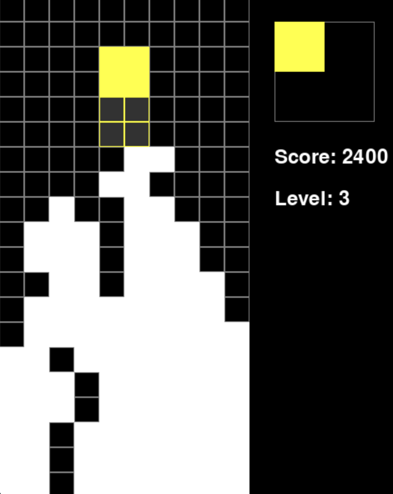

# Python Tetris

A classic implementation of Tetris using Python and Pygame. This game features all the standard Tetris mechanics along with modern features like ghost pieces and a next-piece preview.



## Features

- Classic Tetris gameplay mechanics
- Ghost piece preview showing where pieces will land
- Next piece preview
- Score tracking and level progression
- Increasing difficulty as levels progress
- Clean, modern visual design

## Requirements

- Python 3.7+
- Pygame 2.5.2
- NumPy 1.24.3

## Installation

1. Clone the repository:
```bash
git clone https://github.com/YOUR_USERNAME/python-tetris.git
cd python-tetris
```

2. Create a virtual environment (optional but recommended):
```bash
python -m venv venv
source venv/bin/activate  # On Windows use: venv\Scripts\activate
```

3. Install dependencies:
```bash
pip install -r requirements.txt
```

## How to Play

Run the game using:
```bash
python tetris.py
```

### Controls

- **Left Arrow**: Move piece left
- **Right Arrow**: Move piece right
- **Up Arrow**: Rotate piece
- **Down Arrow**: Soft drop (move piece down faster)
- **Spacebar**: Hard drop (instantly drop piece)

### Scoring

- Points are awarded for clearing lines
- Clearing multiple lines at once gives bonus points
- The game speeds up as your score increases
- Each level increases the falling speed of the pieces

## Project Structure

```
python-tetris/
├── tetris.py          # Main game file
├── requirements.txt   # Python dependencies
└── README.md         # This file
```

## Contributing

Feel free to fork this project and submit pull requests with improvements. Some ideas for contributions:

- Add sound effects
- Implement high score tracking
- Add different game modes
- Improve visual effects

## License

This project is licensed under the MIT License - see the [LICENSE](LICENSE) file for details.

## Acknowledgments

- Original Tetris game design by Alexey Pajitnov
- Built with [Pygame](https://www.pygame.org/) 